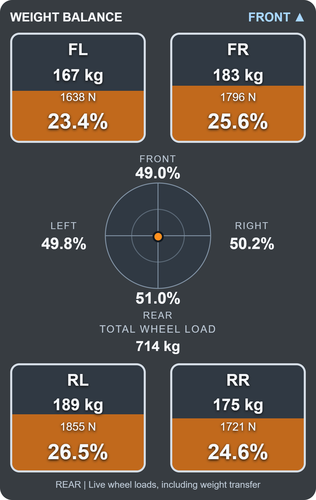
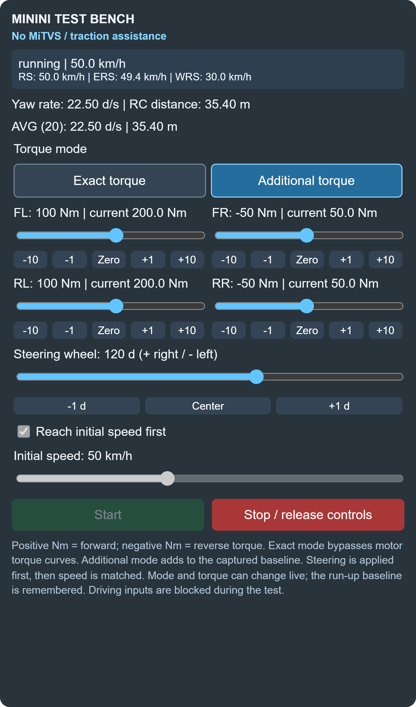
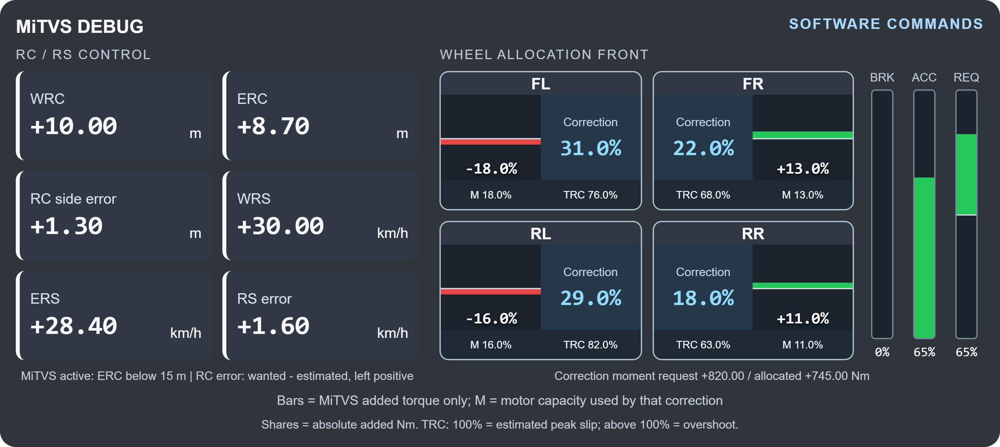
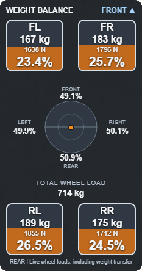

# MiNini BeamNG Toolkit

Small tools for developing, testing and driving cars in BeamNG. Each mod is a separate ZIP, so you can install just the ones you use.

[Download the release pack](https://github.com/MihiOr/minini-beamng-toolkit/releases/latest)

## Widgets

<table>
  <tr><th>Weight Balance</th><th>Minini Test Bench</th></tr>
  <tr>
    <td align="center"></td>
    <td align="center"></td>
  </tr>
  <tr>
    <td>Live corner loads and combined front/rear and left/right balance.</td>
    <td>Per-wheel torque, steering and initial-speed controls.</td>
  </tr>
  <tr><th colspan="2">MiTVS Debug</th></tr>
  <tr><td colspan="2" align="center"></td></tr>
  <tr><td colspan="2">RC/RS targets, per-wheel added torque, correction shares and pedal requests.</td></tr>
</table>

Previews use the actual Vue/CSS with sample telemetry. MiTVS Debug shows the current RC/RS interface; v22_65 uses the older yaw controller.

## Included mods

| Mod / ZIP | What it does | How to use it |
| --- | --- | --- |
| **Weight Balance** — `CompanionWeightBalance.zip` | Shows FL, FR, RL and RR tire loads in kg, N and percent; total wheel load; and combined front/rear and left/right percentages on a circular dial. | Add **Companion Weight Balance** from BeamNG's UI Apps menu. |
| **Debug Memory** — `CompanionDebugMemory.zip` | Saves the vehicle debug modes you last used and restores them after switching vehicles or restarting the game. Includes mesh visibility, debug spawn and vehicle debug info. | Enable the mod and use the game's **Debug actions** tab as usual. |
| **Mouse Steering Toggle** — `CompanionMouseSteering.zip` | Toggles the Mouse X steering binding with the **Wheel (direct)** filter. Keeps other mouse and keyboard controls. | In **Controls → Vehicle**, bind **Toggle mouse steering (direct)** to **G** or another key. |
| **Spawn Heading** — `CompanionSpawnHeading.zip` | Turns marked vehicles 90° right on spawn. Changes placement, without rotating their node or mesh data. | Enable the spawn-heading override in AutoCraft Companion, or add the marker described below to the vehicle. |
| **Dashboard Telemetry** — `CompanionDashboard.zip` | Sends active-vehicle speed, G forces, controls, lights, gear and available EV energy data over localhost UDP. | Use AutoCraft Companion's **Dashboard** tab to forward it to a COM port and STM32. |
| **Camera Speed** — `CompanionCameraSpeed.zip` | Sets free-camera movement speed to 100. | Enable the mod, then use the free camera. |
| **Rotation Centers** — `MininiRotationCenter.zip` | Green actual RC, yellow estimated ERC and blue wanted WRC. | Enable the mod; ERC/WRC require a compatible Companion ECU. |
| **Minini Test Bench** — `MininiTestBench.zip` | Steering, run-up speed, exact/additional wheel torque and RC/RS readings. | Add **Minini Test Bench** from UI Apps; start/stop a prescribed run. |
| **MiTVS Debug** — `MiTVSDebug.zip` | RC/RS targets, per-wheel added correction, slip estimates and pedal requests. | Add **MiTVS Debug** from UI Apps; use a compatible Companion ECU. |
| **Minini Live Debugger** — `MininiDebug.zip` | Local UDP control and motor/IMU telemetry. | Use the Companion diagnostic client described below. |

Weight Balance, Minini Test Bench and MiTVS Debug provide UI widgets. Vehicle-control helpers require a compatible Companion EV; they do not convert stock cars. The ECU and four-IMU sensor definitions are supplied by Companion's vehicle patcher.

## Install

1. Extract `MiNini-BeamNG-Toolkit-v0.2.0.zip`.
2. Copy whichever **individual mod ZIP files** you want into the current BeamNG user folder's `mods` directory. Keep those individual ZIPs packed.
3. Enable the mods in Mod Manager and restart BeamNG.

The outer release ZIP contains the ten mod ZIPs, installation notes, a pack manifest and SHA-256 checksums. Extract it first; BeamNG does not install nested ZIPs from the outer bundle.

These mods keep the existing `Companion...` filenames and extension IDs. If you already installed them through AutoCraft Companion, or have unpacked copies, use one active copy of each. This pack contains standalone helpers; the vehicle-specific suspension, EV conversion, ECU, tire and latch patches remain in [AutoCraft Companion](https://github.com/MihiOr/autocraft-companion).

## Mod details

### Weight Balance

<details>
<summary>In-game screenshot</summary>



</details>

The four boxes stay in vehicle order: front left/right at the top, rear left/right at the bottom. The center dot moves toward the more heavily loaded side and axle. Center means a 50/50 split on both axes.

It reads actual wheel forces from `wheelInfo`, including dynamic weight transfer. The kg values are wheel force divided by gravity. This is a tire-load display, not a measurement of the physical center-of-gravity position. It requires wheel names **FL / FR / RL / RR**. Missing or unloaded wheels produce an unavailable balance instead of a made-up percentage.

### Debug Memory

Remembers nodes, beams, torsion bars, rails, collision triangles, center of gravity, aerodynamics, tire contact debug, steering geometry and other scalar debug settings exposed by the game. Turning a visualization off is remembered too.

State is stored in the BeamNG user folder at `settings/companionDebugMemory.json`. It polls the current player's debug state every half second and restores supported settings after the next vehicle initializes. Part selections, custom node-debug text and UI layouts are not carried between cars. Disable the mod to stop automatic restore.

### Mouse Steering Toggle

The toggle adds or removes steering on the horizontal mouse axis using the game's normal binding writer. The binding persists in BeamNG's input settings. Turn the toggle **off before disabling the mod** if you want that steering binding removed. It does not change steering geometry or hydraulic response rates.

### Spawn Heading

Only vehicles with this file at `vehicles/<vehicle-folder>/companion_spawn_heading.json` are affected:

```json
{"rightDegrees": 90}
```

The helper applies the correction during spawn and replacement, avoiding repeated rotation when replacing an already corrected car. It fixes placement only; internal vehicle axes keep their existing orientation. AutoCraft Companion can add the marker when patching a vehicle.

### Dashboard Telemetry

The game extension sends JSON telemetry to **127.0.0.1:28574**, targeting 24 samples per simulation second, for the active player vehicle. G forces use the same sensor signals as BeamNG's G-meter. Electric battery data is included when available; trip counters reset with the vehicle.

The mod does not open a COM port. For the full chain, keep **AutoCraft Companion open** and connect its Dashboard bridge: **BeamNG → Companion → STM32 → Android**. Serial defaults to **921600 baud, 8N1**. See the Companion repository's [dashboard transport notes](https://github.com/MihiOr/autocraft-companion/blob/main/docs/DASHBOARD_SERIAL.md) for the binary fields, dummy receiver and ECU receipt requirements. Ordinary game use does not require a dashboard connection.

## Live diagnostics

Minini Live Debugger uses localhost UDP: commands on port 28580 and telemetry on 28581. The client is [minini_debug.py](https://github.com/MihiOr/autocraft-companion/blob/main/src/minini_debug.py); command documentation is [MININI_DEBUG.md](https://github.com/MihiOr/autocraft-companion/blob/main/docs/MININI_DEBUG.md). Only supported four-motor Companion EVs accept control commands. Commands temporarily take ownership of vehicle inputs; the control lease expires if commands stop. Avoid running multiple control tools at once.

MiTVS Debug displays the ECU's requested corrections, not measured shaft output. Its correction shares describe only torque added by MiTVS. The test bench bypasses ECU assistance during prescribed runs. ERC uses four smoothed virtual IMUs plus velocity aiding; WRC/desired rotation speed currently use the primitive ECU's fixed targets. See [the ECU notes](https://github.com/MihiOr/autocraft-companion/blob/main/docs/PRIMITIVE_ECU.md).

## Build and checks

Building ZIPs only needs Python:

```powershell
python build_release.py
```

Individual mod ZIPs and the outer release appear in `dist/`. The build is deterministic and does not read your game profile, saved settings, accounts or installed vehicles.

Developer checks:

```powershell
python -m pip install -r requirements-dev.txt
python -m unittest discover -s tests -v
node --test tests/balance.test.mjs
python tools/check_repo.py
```

To regenerate the high-resolution preview, install Node dependencies and run the renderer. It uses a separate headless Edge instance on Windows:

```powershell
npm ci
npm run render
```

For another Chromium installation, set `RENDER_BROWSER` to `chrome` or set `RENDER_CHROMIUM_PATH` to its executable. The preview uses the real template, styles and balance calculations with fixed sample telemetry; it does not need BeamNG running.

No game assets, personal vehicle exports, accounts, board identifiers or saved debug/input settings are bundled. These are unofficial BeamNG extensions. Automated checks cover the package contents, widget calculations and Lua behavior; they do not replace an in-game check after game updates.
